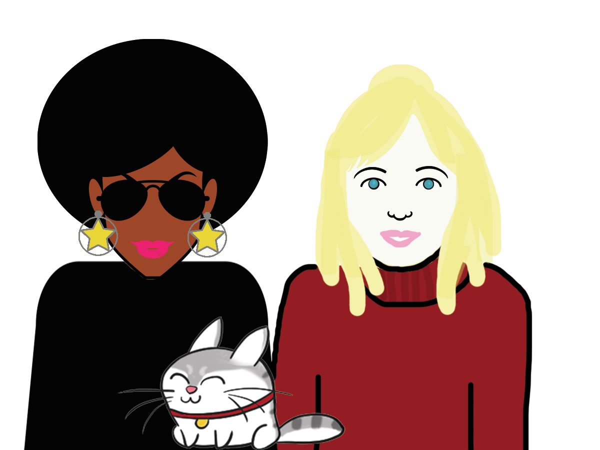

# 女性線上安全自助指南　

_“不管我作什麼 - 他都可以找到，現在我知道他是如何做到的了... ”

“哇, 這真是讓我大開眼界！”

“這是頭一回任何人都可以揭開這一切 - 通常當權者似乎沒有任何頭緒…”_

## 這份指南要給誰看？

任何地方的任何一個人。雖然這份資料在撰寫時預設的讀者群是那些受到家庭暴力或跟踪狂的受害女性，但它所採用的原則與方法並不受性別、地點與情況的限制

某人持有你的照片但你自己並不知對方怎會有你的照片以及留著照片的理由？這些人是否會意外地出現在你常去的地方？他們是否了解你不曾告訴別人的私人生活？如果以上　這些情況，很可能你已經被人跟踪了。

## 這份指南在講什麼？

這裏會談談現代科技，如互聯網和行動電話等等，這些工具大大地提高了暴力加害者更方便進行跟踪、恐嚇與威脅他們所欲獵取的目標，不管是在網路上線或是現實生活裏。但好消息是：我們可以採取一些手段來保護自己！利用這份指南的最佳實踐，來評估了解自己面臨何種風險並試著奪回我們自主的掌控權。

## 如何使用這份指南？

有許多方法可以讓某人追踪你，這類偷襲的機會是否容易經常發生取決於每個人自身的狀況以及對方跟踪者。這份指南並無法提供完整全部的答案，也沒法列出所有施暴跟踪者會採取的方法，但它試著收錄一些我們找到的有用建議與支持資源，讓我們馬上來了解吧。

---
 DIY Online Security by <a xmlns:cc="http://creativecommons.org/ns#" href="http://chayn.co" property="cc:attributionName" rel="cc:attributionURL">CHAYN</a> is licensed under a <a rel="license" href="http://creativecommons.org/licenses/by-sa/4.0/">Creative Commons Attribution-ShareAlike 4.0 International License</a>.
