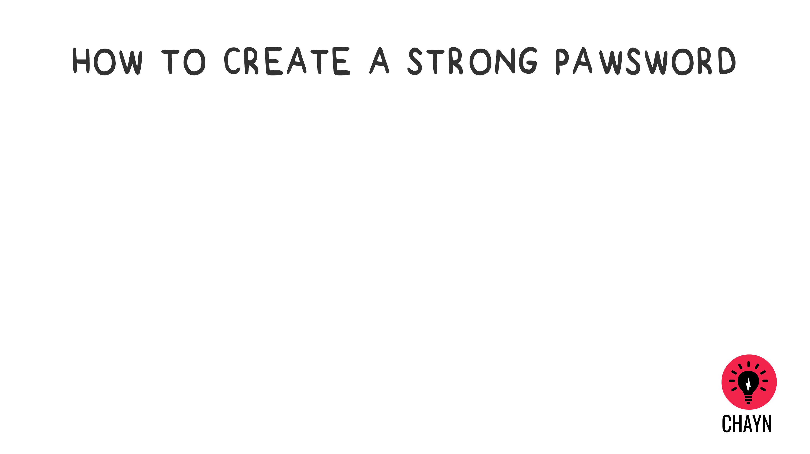

# 如何設定一個完勝的密碼 \(呃..這個我們也無能為力\)
簡單步驟來對抗最常見的弱點

### 1. 密碼保護

* 到這個網站 [How Secure Is My Password](https://howsecureismypassword.net/) 來測試看看自己的密碼是否足夠複雜

* 絕不要重複使用相同密碼

* 不要把同一個密碼運用在各不同網站 - 在不同網路服務註冊時，請設定不同的密碼

* 不要讓瀏覽器儲存記錄個人密碼

* 考慮用密語來取代密碼

* 混合使用大小寫字母、數字、特殊符號 - 可參考這個密碼自動産生服務[Strong Password Generator](https://strongpasswordgenerator.com/) 密碼管理工具通常就會有內鍵的密碼産生器來創建複雜的密碼。

### 2. 使用密碼管理工具

密碼管理工具會以加密方式儲存密碼，因為使用者可以對不同的網站服務各使用不同獨特的安全密碼而無須自己牢記每一個密碼。這方面[ 有很多免費的密碼管理工具](http://thehackernews.com/2016/07/best-password-manager.html)有很多工具可以挑選, 例如,[ KeePass](http://keepass.info/) \(請參見[如何設定與使用(英文版)](https://youtu.be/KQuDrKSZkck), [LastPass](https://www.lastpass.com/) 與 [Padlock](https://padlock.io/).

### 3. 如何更改密碼？

怎樣才是適當更改密碼的頻率，這個話題一直被討論。一般會建議大約每3 – 9 個月更換一次。我們則建議可依你個人的安全感狀態來決定要多久更換密碼。

### 4. 兩要素認證 \(2FA\)

兩要素認證 \(2FA\) 讓任何企圖駭侵你帳號的人更難以得手。除了第一步要利用\(密碼\)登入自己的帳號外, 用戶還得再輸入第二組資料, 通常是一個透過電子郵件、手機簡訊或自手機應用程式産生的短碼。下列這些網路服務已開通了「兩要素認證功能」 [請見此處](http://twofactorauth.org/)。

---
 DIY Online Security by <a xmlns:cc="http://creativecommons.org/ns#" href="http://chayn.co" property="cc:attributionName" rel="cc:attributionURL">CHAYN</a> is licensed under a <a rel="license" href="http://creativecommons.org/licenses/by-sa/4.0/">Creative Commons Attribution-ShareAlike 4.0 International License</a>.
