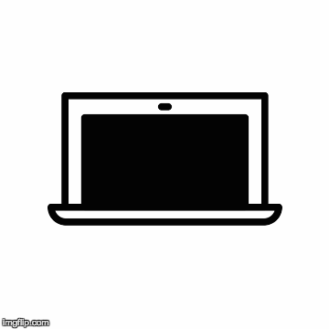
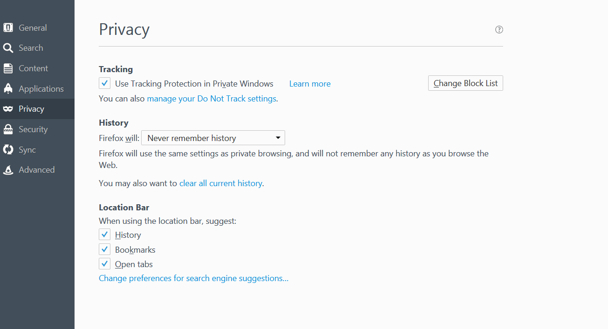

# 如何玩弄 \(哦不.. 保護\) 瀏覽器

### Chrome. Safari. Firefox. Explorer.

首先，利用[Panopticlick](https://panopticlick.eff.org)來檢測你所用瀏覽器目前的安全程度。 

接下來

遮蓋住網路攝影機!

## 瀏覽器隱私設定 - 不要被追踪與私密瀏覽視窗

## 不要被追踪

**Chrome** &gt; 設定 &gt; 顯示進階設定 &gt; &gt; 隱私 &gt; 送出 “不要被追踪” 請求給瀏覽器

**Firefox** &gt; 選項 &gt; 隱私 &gt; 管理“不要被追踪”設定

**Safari** &gt; 選單 &gt; 偏好 &gt; 隱私 &gt; 網站追踪 &gt; 要求網站不要追踪我

**Explorer** &gt; 工具 \(Alt + X\) &gt; 安全 &gt; 開啟防追踪保護 &gt; 

**Alternative Browsers and Search Engines**

* [Brave](https://www.brave.com/) 這個瀏覽器可以自動地封鎖廣告和追踪器。
* [Tor](https://www.torproject.org/) 瀏覽軟體可讓人匿名地瀏覽網頁。
* [DuckDuckGo](https://duckduckgo.com/about) 是一個私密的搜尋引擊它不會追踪用戶的記錄。
* [StartPage](https://www.startpage.com) 也是一個私密搜尋引擊，不會記錄用戶的IP也不會追踪其引擊內容。

**失憶模式 \(Chrome\)**

* 網頁失憶模式可防止 Google Chrome 儲存用戶曾訪問與下載的記錄
* 自定控制 Google Chrome &gt; 新失憶視窗
* 或按住： Ctrl + Shift + N　三個鍵

**新私密瀏覽視窗 \(Firefox\)**

* 「新私密視窗」功能可在Firefox底下啟動私密瀏覽功能
* 打開選單 &gt; 選擇新私密視窗
* 或按住: Ctrl + Shift + P　三個鍵

**新私密視窗 \(Safari\)**

* 新私密視窗可阻止 Safari 保存你在檢視哪些網頁記錄
* 檔案選單 &gt; 選擇新私密視窗
* 或按住: Command + Shift + N　三個鍵

**InPrivate**

* InPrivate 有助於防止Internet Explorer 儲存你瀏覽期間的記錄。
* 工具 &gt; 安全 &gt; InPrivate 瀏覽
* 或是按住: Ctrl + Shift + P

### **使用 VPN**

* VPN, 或稱私人虛擬網路, 可以用來偽裝自己真實的IP位置並且加密你所有的網路連線內容，這樣別人就無法找到你在網路世界裏瀏覽了什麼東西。
* 免費 VPN: [OkayFreedom](http://www.okfreedom.com/en/) \(請注意: 免費版的OkayFreedom 內含[廣告](http://www.okfreedom.com/en/support#free)\) [TunnelBear](https://www.tunnelbear.com/)

## **Tor**

Tor 瀏覽器是設計用來協助用戶維持線上匿名，也是一個簡單有效的方法讓使用者不必向別人揭露自己的互聯網瀏覽記錄。

它可以[在此](https://www.torproject.org/projects/torbrowser.html)下載。

 ## 瀏覽器附加元件

瀏覽器附加元件e \(Add-ons\/plug ins\), 是可用於瀏覽器上節延伸程式與自定化工具。附加元件可以用來保護用戶隱私，阻止第三者追踪用戶線上活動。警告提醒：有些附加元件可能是惡意軟體 [例如](http://www.makeuseof.com/tag/x-malicious-browser-extensions-help-hackers-target-victims)，請多小心。

### 推薦的瀏覽附加元件:

* [HTTPS Everywhere](https://www.eff.org/https-everywhere) \(Hypertext Transfer Protocol with Secure Sockets Layer\)　安全加密連線可以確保用戶上網的隱私安全。
* [Privacy Badger](https://www.eff.org/privacybadger) 可以封鎖追踪器 [cookies](https://en.wikipedia.org/wiki/HTTP_cookie)
* [uBlock Origin](https://www.ublock.org) 是可以廣告封堵工具。

# 清除瀏覽記錄

* Chrome &gt; 歷史記錄 &gt; 清除瀏覽資料
* Firefox &gt; 選項 &gt; 隱私 &gt; 瀏覽記錄
* 推薦電腦使用的清掃工具:
* [CCleaner](http://www.piriform.com/ccleaner)
* [BleachBit](http://www.bleachbit.org)

---
 DIY Online Security by <a xmlns:cc="http://creativecommons.org/ns#" href="http://chayn.co" property="cc:attributionName" rel="cc:attributionURL">CHAYN</a> is licensed under a <a rel="license" href="http://creativecommons.org/licenses/by-sa/4.0/">Creative Commons Attribution-ShareAlike 4.0 International License</a>.

