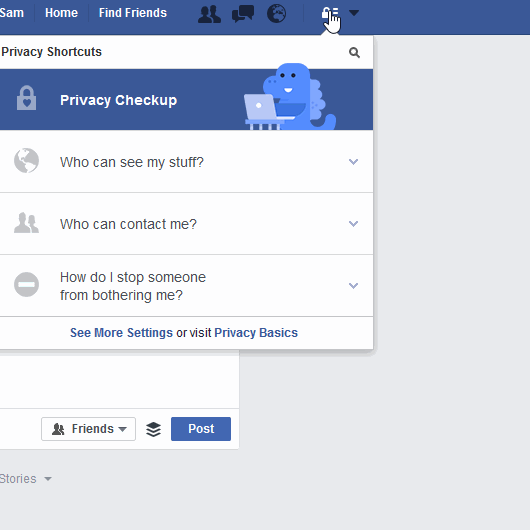
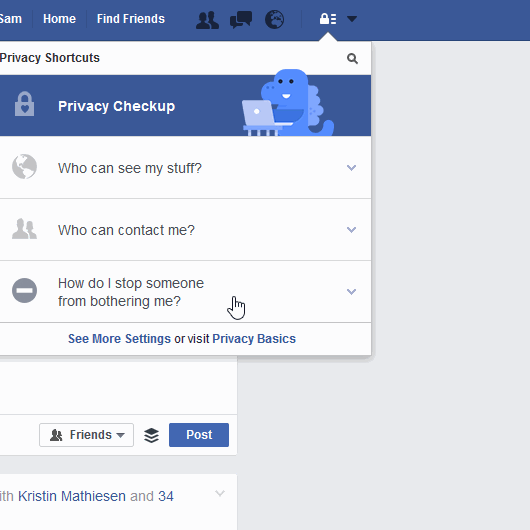

# 社交網站與設備

## 臉書

### 誰可以看到我的東西？

 

### 誰可以與我聯繫？

### 如何阻止別人對我的騷擾？

## 推特

### 安全與隱私

## 設備

### 取消地理位置功能

**如何確保安卓手機安全：** 關閉無線網路與 GPS 定位 \(其設定是在「位置服務」的選項下\) 與手機行動數據 \(這可在　設定 &gt; 個人 &gt; 位置\)。注意：只有當需要時才開啟位置功能，最好是將其默認設定為關閉以減少所在位置被追踪的危險，也可以節省電力與降低不必要的數據流量傳輸在背景中默默執行或是電信服務業者遠端地監控。(參考自: https://securityinabox.org/en/guide/basic-setup/android)

請見[如何設定關閉位置服務（英文）](http://www.wikihow.com/Turn-Off-Location-Services-on-an-Android)

**如何提高iPhone安全：** 關閉無線網路與 GPS 定位，在 設定 > 隱私 > 位置服務　要不利用關閉所有位置服務的滑塊或是在每一個與位置相關的 app 或項目滑塊區去關閉其位置功能。 要取消Safari app上的所以網站取得地理位置的功能，則到Safari app滑塊下作設定。

請見 [如何關閉iOS上的位置服務功能](http://www.tomsguide.com/us/turn-off-location-services-iphone,news-21276.html)|

## 簡訊聊天程式

### Whatsapp

[WhatsApp](https://www.whatsapp.com) 訊息有予加密 \(這代表你所送出的訊息內容只有你和收件人可以看到\) 但是有關你與對方之間通訊的元數據，例如和誰傳訊、曉時間、多久等資料仍然會被收集與儲存。

### Signal

[Open Whisper Systems](https://whispersystems.org/)團隊所開發的 Signal 是一個[免費開源](https://en.wikipedia.org/wiki/Free_and_open-source_software) 的加密[網路電話](
https://en.wikipedia.org/wiki/Voice_calling) 與即時通訊應用，它可執行於Android, iOS手機以及電腦[桌面](https://whispersystems.org/blog/signal-desktop)。它採用[端對端加密方式](https://en.wikipedia.org/wiki/End-to-end_encryption) 以確保與其它用戶之間所有通訊的安全。Signal 可用於傳送與接收加密的即時訊時、群組訊息、附件和多媒體訊息。

[Signal 用戶應知的安全事項（英文）](https://theintercept.com/2016/07/02/security-tips-every-signal-user-should-know/)

# 其它建議

* 重要: 進行這個[Smart Privacy隱私小測試（英文）](http://smartprivacy.tumblr.com/privacynow)
* 為自己的姓名建立一個[Google Alert提醒](https://www.google.com/alerts) 

---
 DIY Online Security by <a xmlns:cc="http://creativecommons.org/ns#" href="http://chayn.co" property="cc:attributionName" rel="cc:attributionURL">CHAYN</a> is licensed under a <a rel="license" href="http://creativecommons.org/licenses/by-sa/4.0/">Creative Commons Attribution-ShareAlike 4.0 International License</a>.
